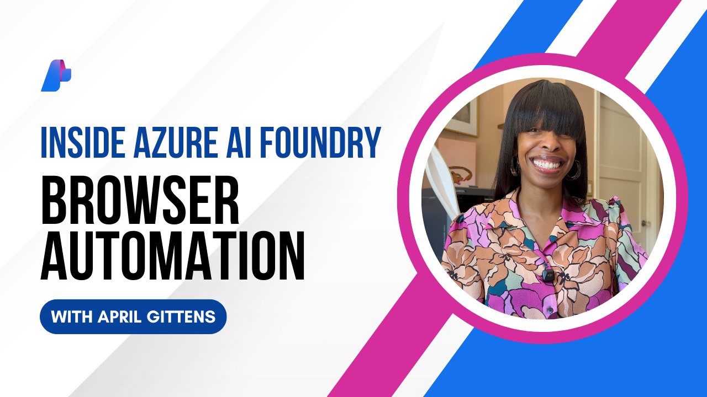

# Browser Automation

See the Browser Automation Tool (Preview) in Microsoft Foundry in action! In this episode, April demonstrates how you can give a natural language request to an agent and watch as the agent executes browser tasks on your behalf. Powered by Playwright Workspaces running in your Azure subscription, each session is fully isolated and secure. The model inspects the page’s structure, decides what actions to take, and executes them step-by-step, adjusting along the way until the task is complete.

Try it out today in Microsoft Foundry and see what you can automate: [ai.azure.com](https://ai.azure.com)

## Warning

The Browser Automation tool comes with significant security risks. Both errors in judgment by the AI and the presence of malicious or confusing instructions on web pages which the AI encounters may cause it to execute commands you or others do not intend, which could compromise the security of your or other users' browsers, computers, and any accounts to which the browser or AI has access, including personal, financial, or enterprise systems. By using the Browser Automation tool, you are acknowledging that you bear responsibility and liability for any use of it and of any resulting agents you create with it, including with respect to any other users to whom you make Browser Automation tool functionality available, including through resulting agents. We strongly recommend using the Browser Automation tool on low-privilege virtual machines with no access to sensitive data or critical resources.

## Prerequisites

- An Azure account with an active subscription. If you don't have an Azure subscription, create a [free account](https://azure.microsoft.com/free/) before you begin.
- Your Azure account needs the [Owner](https://learn.microsoft.com/azure/role-based-access-control/built-in-roles#owner), [Contributor](https://learn.microsoft.com/azure/role-based-access-control/built-in-roles#contributor), or one of the [classic administrator roles](https://learn.microsoft.com/azure/role-based-access-control/rbac-and-directory-admin-roles#classic-subscription-administrator-roles).
- [Azure CLI](https://learn.microsoft.com/cli/azure/install-azure-cli?view=azure-cli-latest) installed
- A [Microsoft Foundry](https://ai.azure.com) project
- A Microsoft Foundry "agent supported" model deployment
- A [Playwright Workspace](https://learn.microsoft.com/azure/app-testing/playwright-workspaces/how-to-manage-playwright-workspace) resource

*Note: Only **agent supported** models can be used with the Browser Automation tool. You can filter to **Agent supported** models in the **Model Catalog** via the **Capabilities** filter.*

## Connect Playwright Workspace to Microsoft Foundry

1. Generate an [Access Token](https://learn.microsoft.com/azure/app-testing/playwright-workspaces/how-to-manage-access-tokens) for your Playwright Workspace resource and copy the token somewhere that you can later access.
1. In the [Microsoft Foundry](https://ai.azure.com) portal, open your project.
1. Navigate to **Management Center** > **Connected Resources**.
1. Create a new connection.
1. Search for **Serverless Model** and select the **Serverless Model** connection type.
1. Enter the following:
    - **Target URI**: Your Playwright Workspace Region (e.g., The **Browser endpoint** which is available in the Azure portal on the **Overview** page for your Playwright Workspace resource. It starts with **wss://...**.)
    - **Key**: Your Playwright Workspace Access Token

## Run the Sample

1. Navigate to the folder: `cd Samples/Browser-Automation-Tool`
1. Install dependencies: `pip install -r requirements.txt`
1. Set up environment variables: `copy .env.example .env`
1. Authenticate to Azure using Azure CLI: `az login`
1. Run the script: `python browser-automation.py`
