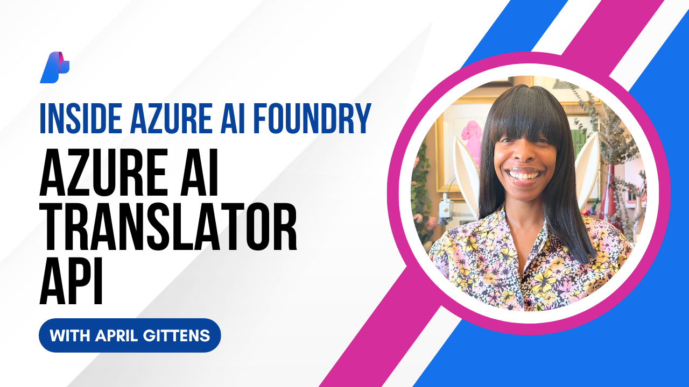

# Azure AI Translator API (Public Preview)

The Azure AI Foundry Translator API (Public Preview) enables you to translate text leveraging neural machine translation (NMT) or large language model translation (LLM). In this episode, April shows you how to translate a conversation between an English speaking customer support agent and a French speaking customer, accommodating for both tone and gender.

Try it yourself in Azure AI Foundry and start translating with LLMs: [ai.azure.com](https://ai.azure.com)

Learn more about the Azure AI Translator API: [aka.ms/insideAIF/translator-API](https://aka.ms/insideAIF/translator-API)
Configure your Azure AI Foundry resource: [aka.ms/insideAIF/configure-Azure-resources](https://aka.ms/insideAIF/configure-Azure-resources)

## Prerequisites

- An Azure AI Foundry resource created the [Azure portal](https://portal.azure.com)

## Run the Sample

1. Navigate to the folder: `cd Samples/Translator-API`
1. Install dependencies: `pip install -r requirements.txt`
1. Set up environment variables: `copy .env.example .env`
1. Run the samples.